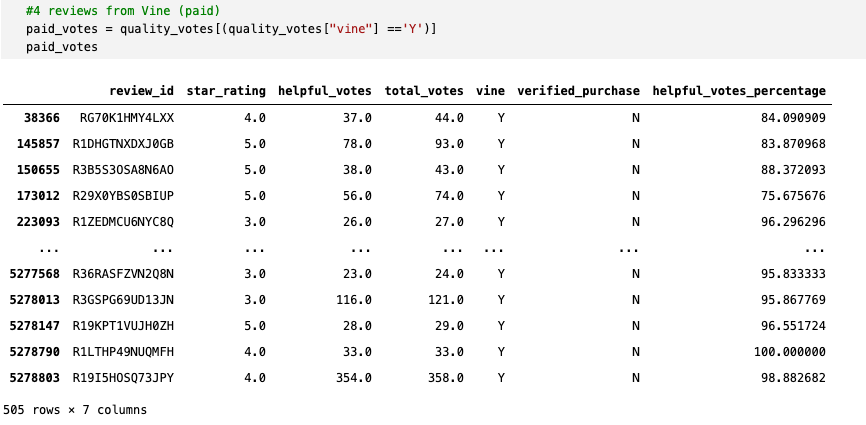
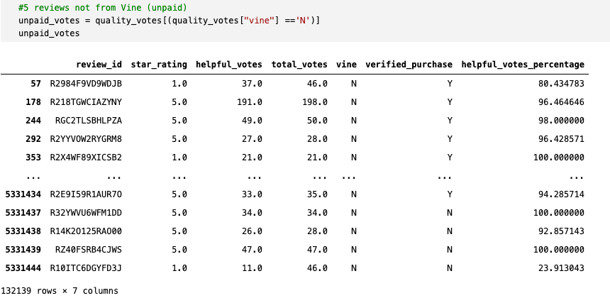
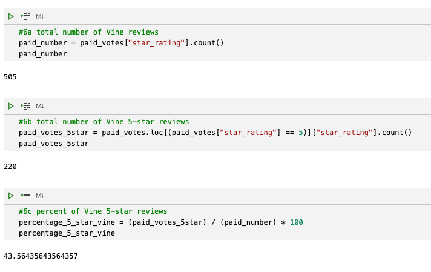
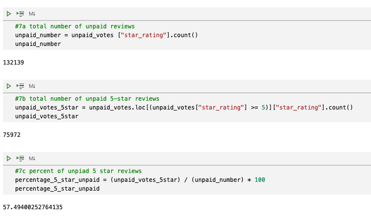

# Amazon Vine Analysis

## Overview
Does the Amazon Vine program produce bias towards favorable reviews? To answer the question, I examined just one of Amazon's large datasets in the health and personal care vertical. 

Amazon Vine is a program that enables a select group of Amazon customers to post opinions about new and pre-release items to help customers make educated purchasing decisions. Companies pay a small fee to Amazon and provide products to Amazon Vine members, who are then required to publish a review.

## Results
The data was filtered first by "vote count" equal to or greater than 20 and "helpful votes" equal to or greater than 50%. From there data was divided by reviews written as part of the paid Vine program and those not a part of the program (unpaid).

### Looking at the filtered data, the following questions for unpaid and paid program reviews were answered.
* How many Vine reviews and non-Vine reviews were there?
    * 505 Vine reviews
    * 132,139 non-Vine reviews

* How many Vine reviews were 5 stars? How many non-Vine reviews were 5 stars?
    * 220 Vine 5 star reviews
    * 75,972 non-Vine 5 star reviews

* What percentage of Vine reviews were 5 stars? What percentage of non-Vine reviews were 5 stars?
    * 43.56% of Vine reviews were 5 stars
    * 57.49% of non-Vine reviews were 5 stars

## Summary
While the number of Vine reviews is substantially smaller than non-Vine reviews there isn't a bias towards favorable reviews just because Vine reviews are paid for. Only 44% of Vine reviews were 5 stars compared with 57% of 5 star non-Vine reviews. And while it is possible the percentage outcome is skewed based on the 5 star review quantity (220 vs 75,972), the 13% difference between the percentages is substantial. To further support that Vine reviews do not present a bias, I would look at 3 and 4 star reviews which tend to be the most popular ratings. In addition, looking at the written reviews would provide more details on potential bias.